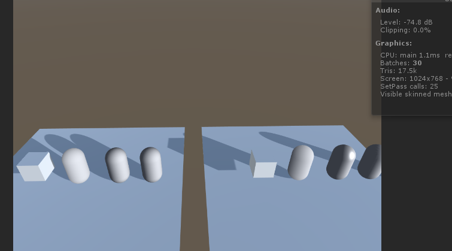

# 这是一个日常学习和记录常见shader的仓库，有时间会继续学习和加入更多更好玩的shader。

# SceneModel_05 AlphaTest裁剪

关键点：  
`
Tags {  
		"Queue"="AlphaTest"   
		"IgnoreProjector"="True"   
		"RenderType"="TransparentCutout"  
	}  
`
Queue渲染队列，必须是AlphaTest;
`clip(col.a - _Cutoff);` 通过clip()函数，对col.a - _Cutoff小于0的像素，进行舍弃。  

# SceneModel_06 混合函数的使用

关键点：  
`
		tags{  
            "Queue" = "Transparent"  
            "RenderType" = "Transparent"   
            "IgnoreProjector" = "True"  
            }  
		Blend SrcAlpha OneMinusSrcAlpha  
`
公式如下：源目标像素alpha+当前像素*（1-源目标像素alpha）

# SceneModel_07 UV旋转动画

关键点：  
`
				float2 uv = data.uv- float2(0.5,0.5);
				float2 rotate = float2(cos(_RotateSpeed*_Time.x),sin(_RotateSpeed*_Time.x));
				uv = float2(uv.x*rotate.x +uv.y*rotate.y,-uv.x*rotate.y+uv.y*rotate.x);
				uv+=float2(0.5,0.5);
`
分析：现将uv偏移到中心点，然后绕Z轴进行旋转，旋转矩阵如下
`
cos角度 -sin角度
sin角度 cos角度
`
将uv坐标绕Z旋转之后，在把坐标还原。

# SceneModel_08 简单纹理使用

关键点：  
`
			v2f vert(appdata_base data){
				v2f ot;
				ot.pos = UnityObjectToClipPos(data.vertex);
				TRANSFORM_TEX(data.texcoord,_MainTex);
				return ot;
			}

			half4 frag(v2f data):COLOR{
				half4 c = tex2D(_MainTex,data.uv.xy) * _Color;
				return c;
			}
`
分析：顶点着色器中进行纹理坐标转换，然后在片段着色器中进行纹理采样

# SceneModel_09 序列帧动画、无限循环背景、顶点动画

1. 序列帧帧动画  
   关键点：  
   `
   			fixed4 frag (v2f i) : SV_Target {
				float time = floor(_Time.y * _Speed);  //取最大整数
				float row = floor(time / _HorizontalAmount);
				float column = time - row * _HorizontalAmount;
				half2 uv = i.uv + half2(column, -row);//纹理的uv坐标系是原点在左下，序列帧的uv坐标系的原点在左上
				uv.x /=  _HorizontalAmount;
				uv.y /= _VerticalAmount;
				fixed4 c = tex2D(_MainTex, uv);
				c.rgb *= _Color;
				
				return c;
			}
   `
   分析：先算出当前时刻下，该显示的纹理点。然后把纹理进行便宜，使该显示的纹理点在中心。然后将整个纹理进行缩放，使之只有一个sprite的大小，即可播放一个序列帧动画。  

2.  无限循环背景
   关键点：  
   `
			v2f vert (a2v v) {
				v2f o;
				o.pos = UnityObjectToClipPos(v.vertex);
				
				o.uv.xy = TRANSFORM_TEX(v.texcoord, _MainTex) + float2(_ScrollX, 0.0) * _Time.y;
				o.uv.zw = TRANSFORM_TEX(v.texcoord, _DetailTex) + float2(_Scroll2X, 0.0) * _Time.y;
				
				return o;
			}
   `
   分析：这里采用了两张贴图，一前一后，背景动起来的实现是通过一直增加纹理坐标实现的。  

3. 顶点动画
    关键点1：
    `
    //顶点动画必须取消合批
		Tags {
			"Queue"="Transparent" 
			"IgnoreProjector"="True" 
			"RenderType"="Transparent" 
			"DisableBatching"="True"
			}
    `
    分析：顶点动画必须取消合批，因为不取消合批，可能会出现不可预料的显示错误。    
    关键点1：
    `
    			v2f vert(a2v v) {
				v2f o;
				
				float4 offset;
				offset.yzw = float3(0.0, 0.0, 0.0);
				offset.x = sin(_Frequency * _Time.y + v.vertex.x * _InvWaveLength + v.vertex.y * _InvWaveLength + v.vertex.z * _InvWaveLength) * _Magnitude;
				o.pos = UnityObjectToClipPos(v.vertex + offset);
				
				o.uv = TRANSFORM_TEX(v.texcoord, _MainTex);
				o.uv +=  float2(0.0, _Time.y * _Speed);
				
				return o;
			}
    `
    分析：` offset.x = sin(_Frequency * _Time.y + v.vertex.x * _InvWaveLength + v.vertex.y * _InvWaveLength + v.vertex.z * _InvWaveLength) * _Magnitude; `实现x点的坐标按sin函数执行偏移。sin函数的公式，请自己搜索。  

#SceneModel_11 法线纹理的使用

因为法线存贮在切线空间中，所以，有两种实现方式：第一种，在切线空间中实现光照计算，这种的效率比较好一点。第二种，在世界空间中实现光照计算，这种通用性好一点，但是需要更多的计算，效率也低一点。  
1.  切线空间中实现光照计算  
    关键点：
    `
    //定义顶点shader
			v2f vert(appdata_tan v)  
			{  
				v2f o;  
				o.pos = UnityObjectToClipPos(v.vertex);  
				//这个宏为我们定义好了模型空间到切线空间的转换矩阵rotation，注意后面有个；
				TANGENT_SPACE_ROTATION;
				//ObjectSpaceLightDir可以把光线方向转化到模型空间，然后通过rotation再转化到切线空间
				o.lightDir = mul(rotation, ObjSpaceLightDir(v.vertex));
				//通过TRANSFORM_TEX宏转化纹理坐标，主要处理了Offset和Tiling的改变,默认时等同于o.uv = v.texcoord.xy;
				o.uv = TRANSFORM_TEX(v.texcoord, _MainTex);
				return o;
			}
    `  
    `
			//定义片元shader
			fixed4 frag(v2f i) : SV_Target
			{
				//unity自身的diffuse也是带了环境光，这里我们也增加一下环境光
				fixed3 ambient = UNITY_LIGHTMODEL_AMBIENT.xyz * _Diffuse.xyz;
				//直接解出切线空间法线
				float3 tangentNormal = UnpackNormal(tex2D(_BumpMap, i.uv));
				//normalize一下切线空间的光照方向
				float3 tangentLight = normalize(i.lightDir);
				//根据半兰伯特模型计算像素的光照信息
				fixed3 lambert = 0.5 * dot(tangentNormal, tangentLight) + 0.5;
				//最终输出颜色为lambert光强*材质diffuse颜色*光颜色
				fixed3 diffuse = lambert * _Diffuse.xyz * _LightColor0.xyz + ambient;
				//进行纹理采样
				fixed4 color = tex2D(_MainTex, i.uv);
				fixed4x4 d;
				return fixed4(diffuse * color.rgb, 1.0);
			}
    `
    分析：关键还是`TANGENT_SPACE_ROTATION;`这个宏的使用，将光照方向转换到切线空间中。然后在片段着色器中，在切线空间下实现光照计算。  

2. 在世界空间中实现光照计算
   关键点：
   `
            v2f vert(a2v v) {
				v2f o;
							
				o.pos = UnityObjectToClipPos(v.vertex);
				
				o.uv = TRANSFORM_TEX (v.texcoord, _MainTex);
				
				//Create a rotation matrix for tangent space
				TANGENT_SPACE_ROTATION;
				o.lightDir = mul(rotation, ObjSpaceLightDir(v.vertex));
				
				float3 worldPos = mul(unity_ObjectToWorld, v.vertex).xyz;
			  	fixed3 worldNormal = UnityObjectToWorldNormal(v.normal);
			  	fixed3 worldTangent = UnityObjectToWorldDir(v.tangent.xyz);
			  	fixed3 worldBinormal = cross(worldNormal, worldTangent) * v.tangent.w;
			  	// Case 1: The codes used by built-in shaders
			  	o.TtoW0 = float4(worldTangent.x, worldBinormal.x, worldNormal.x, worldPos.x);
			  	o.TtoW1 = float4(worldTangent.y, worldBinormal.y, worldNormal.y, worldPos.y);
			  	o.TtoW2 = float4(worldTangent.z, worldBinormal.z, worldNormal.z, worldPos.z);
  
  				// Case 2: The codes which I think are correct 
				float3x3 WtoT = mul(rotation, (float3x3)unity_WorldToObject);
				o.TtoW0 = float4(WtoT[0].xyz, worldPos.x);
				o.TtoW1 = float4(WtoT[1].xyz, worldPos.y);
				o.TtoW2 = float4(WtoT[2].xyz, worldPos.z);
				
				// pass lighting information to pixel shader
  				TRANSFER_VERTEX_TO_FRAGMENT(o);
				return o;
			}
			
			fixed4 frag(v2f i) : COLOR {
				fixed4 texColor = tex2D(_MainTex, i.uv);
				fixed3 norm = UnpackNormal(tex2D(_Bump, i.uv));
				float3 worldPos = float3(i.TtoW0.w, i.TtoW1.w, i.TtoW2.w);
				fixed3 worldViewDir = normalize(UnityWorldSpaceViewDir(worldPos));
				fixed3 lightDir = normalize(UnityWorldSpaceLightDir(worldPos));
				// Case 1
				half3 worldNormal = normalize(half3(dot(i.TtoW0.xyz, norm), dot(i.TtoW1.xyz, norm), dot(i.TtoW2.xyz, norm)));
				// Case 2
				worldNormal = normalize(mul(norm, float3x3(i.TtoW0.xyz, i.TtoW1.xyz, i.TtoW2.xyz)));
				
				fixed atten = LIGHT_ATTENUATION(i);
				
				fixed3 ambi = UNITY_LIGHTMODEL_AMBIENT.xyz;
				
				fixed3 diff = _LightColor0.rgb * saturate (dot (normalize(worldNormal),  normalize(lightDir)));
								
				fixed3 lightRefl = reflect(-lightDir, worldNormal);
				fixed3 spec = _LightColor0.rgb * pow(saturate(dot(normalize(lightRefl), normalize(worldViewDir))), _Specular) * _Gloss;
				
				fixed3 worldView = fixed3(i.TtoW0.w, i.TtoW1.w, i.TtoW2.w);
				fixed3 worldRefl = reflect (-worldViewDir, worldNormal);
				fixed3 reflCol = texCUBE(_Cubemap, worldRefl).rgb * _ReflAmount;
				
				fixed4 fragColor;
				fragColor.rgb = float3((ambi + (diff + spec) * atten) * texColor) + reflCol;
				fragColor.a = 1.0f;
				
				return fragColor;
			}
   `
   分析：首先求出切线空间到世界空间的转换矩阵，然后进入片段着色器。在片段着色器中，将需要用到的切线转换到世界坐标下，然后进行光照计算。  

# SceneModel_12 基础光照模型
 

1. Lambert模型   
    公式：c*d*saturate(Dot(N,L)) 其中N是法线，L是光照方向，都是从顶点触发
2. Phong模型  
    公式：c*d*pow(saturate(Dot(V,R)),gloss) 其中V是视角方向，R是光照的反射方向，都是从顶点触发，gloss越大，高光区域越小。  
3.Pong_Blin模型
    公式：c*d*pow(saturate(Dot(N,H)),gloss) 其中N是法相，H=normalize(V+L)，L是光照方向，V是视角方向，都是从顶点触发，gloss越大，高光区域越小。  

# SceneModel_13 流光效果
 

 关键点：
 `
    v2f vert(appdata_t IN)
    {
        v2f OUT;
        OUT.vertex = UnityObjectToClipPos(IN.vertex);
        OUT.texcoord = TRANSFORM_TEX(IN.texcoord);
        OUT.texflowlight = TRANSFORM_TEX(IN.texcoord, _FlowlightTex);
        OUT.texflowlight.x += _Time * _SpeedX;
        OUT.texflowlight.y += _Time * _SpeedY;
        return OUT;
    }

    fixed4 frag(v2f IN) : SV_Target
    {
        fixed4 c = tex2D(_MainTex, IN.texcoord);
        fixed4 cadd = tex2D(_FlowlightTex, IN.texflowlight) * _Power * _FlowlightColor;
        c.rgb += cadd.rgb;
        //c.rgb *= c.a;
        return c;
    }
 `
 分析： 主纹理不动，流光纹理进行偏移。

 # SceneModel_14 从内往外流光的法阵
 

 关键点:
 `
 v2f vert (appdata v)
			{
				v2f o;
				o.vertex = UnityObjectToClipPos(v.vertex);
				o.uv = TRANSFORM_TEX(v.uv, _MainTex);
				o.fw = TRANSFORM_TEX(v.uv, _FlowTex);
				return o;
			}
			
			fixed4 frag (v2f i) : SV_Target
			{
				fixed4 col = tex2D(_MainTex, i.uv);
				float2 center = float2(0.5,0.5);//uv中心点
				float d = distance(i.uv,center);//当前像素到中心点的距离
				float dmax = 0.5;//离中心点的最大距离
				float speed = (dmax+_FlowWidth)/_Period;//没秒移动的速度
				float progress = fmod(_Time.y,_Period)/_Period;//当前进度
				float nowmaxd = fmod(_Time.y,_Period)*speed;//时间*速度= 路程，就是当前离中心点的距离
				float nowmind = nowmaxd - _FlowWidth;//最大-宽度 = 最小
				float isInFlow = step(nowmind, d) - step(nowmaxd, d);//如果是在宽度的中间，返回1，不然返回0
				float2 flowTexUV = float2((d - nowmind) / (nowmaxd - nowmind), 0);//计算当前像素在flow的位置比例
				float4 nowdcolor = _CenterColor + (_EdgeColor-_CenterColor)*progress;//当前点的颜色
				fixed4 finalColor = col + isInFlow * _FlowLight * col * tex2D(_FlowTex, flowTexUV)*nowdcolor;
				return finalColor;
			}
 `

 分析：代码每一行都有注释，看注释就行。原理其实就是uv坐标变换，实现的
 实现原理来源于网络，请点击连接前往查看源：[来源网站](https://blog.csdn.net/zzxiang1985/article/details/50706641)

# SceneModel_15 镜面反射、反射、折射
 
 1. 镜面反射
    关键点：
    `
    o.uv = TRANSFORM_TEX(v.uv, _MainTex);
	o.uv.x = 1-o.uv.x;
    `
    将镜像Camera生成的RenderTexture，uv坐标转换之后，x坐标进行镜像。因为x在[0,1]，所以，进行镜像的方法是1-x。  

2. 反射 
    使用CubeMap贴图，第一步是要生成一张CubeMap，然后渲染场景的内容到CubeMap中。
    然后在shader中使用这张CubeMap。
    `
    			v2f vert (appdata_full v)
			{
				v2f o;
				o.vertex = UnityObjectToClipPos(v.vertex);
				o.uv = TRANSFORM_TEX(v.texcoord, _MainTex);
				o.worldPos = mul(unity_ObjectToWorld,v.vertex);
				o.worldNoraml = UnityObjectToWorldNormal(v.normal);
				o.worldViewDir = UnityWorldSpaceViewDir(o.worldPos);
				o.worldFrelect = reflect(-o.worldViewDir,o.worldNoraml);
				UNITY_TRANSFER_FOG(o,o.vertex);
				TRANSFER_SHADOW(o);
				return o;
			}
			
			fixed4 frag (v2f i) : SV_Target
			{
				// sample the texture
				fixed4 col = texCUBE(_MainTex,i.worldFrelect);
				fixed3 am = UNITY_LIGHTMODEL_AMBIENT.xyz;
				fixed3 normal = normalize(i.worldNoraml);
				fixed3 light = normalize(UnityWorldSpaceLightDir(i.worldPos));
				fixed3 view = normalize(i.worldViewDir);
				fixed3 diffuse = am + _LightColor0.xyz*_Diffuse*saturate(dot(normal,light));
				// apply fog
				UNITY_APPLY_FOG(i.fogCoord, col);
				UNITY_LIGHT_ATTENUATION(atten, i, i.worldPos);
				return fixed4(col.xyz+diffuse.xyz*atten,1);
			}
    `
    分析：首先求出视角方向的反射，然后在片段着色器中，使用这个反射对CubeMap进行取样。  

3. 折射
   `
   v2f vert (appdata_full v)
			{
				v2f o;
				o.vertex = UnityObjectToClipPos(v.vertex);
				o.uv = TRANSFORM_TEX(v.texcoord, _MainTex);
				o.worldPos = mul(unity_ObjectToWorld,v.vertex);
				o.worldNoraml = UnityObjectToWorldNormal(v.normal);
				o.worldViewDir = UnityWorldSpaceViewDir(o.worldPos);
				o.worldFralect = refract(-o.worldViewDir,o.worldNoraml,_Refract);
				UNITY_TRANSFER_FOG(o,o.vertex);
				TRANSFER_SHADOW(o);
				return o;
			}
			
			fixed4 frag (v2f i) : SV_Target
			{
				// sample the texture
				fixed4 col = texCUBE(_MainTex,i.worldFralect);
				fixed3 am = UNITY_LIGHTMODEL_AMBIENT.xyz;
				fixed3 normal = normalize(i.worldNoraml);
				fixed3 light = normalize(UnityWorldSpaceLightDir(i.worldPos));
				fixed3 view = normalize(i.worldViewDir);
				fixed3 diffuse = am + _LightColor0.xyz*_Diffuse*saturate(dot(normal,light));
				// apply fog
				UNITY_APPLY_FOG(i.fogCoord, col);
				UNITY_LIGHT_ATTENUATION(atten, i, i.worldPos);
				return fixed4(col.xyz+diffuse.xyz*atten,1);
			}
   `
    分析：首先求出视角方向的折射，然后在片段着色器中，使用这个折射对CubeMap进行取样。    

#  SceneModel_16 折射和反射的混合使用
 
 有需要的可以直接看代码。    

#  SceneModel_17 3D物体边缘光
 

`
    v2f vert (appdata_base v) {
        v2f o;
        o.pos = UnityObjectToClipPos (v.vertex);
        float3 viewDir = normalize(ObjSpaceViewDir(v.vertex));
        float dotProduct = 1 - dot(v.normal, viewDir);
        o.color = smoothstep(1 - _RimWidth, 1.0, dotProduct);
        o.color *= _RimColor;
        o.uv = v.texcoord.xy;
        return o;
    }

    fixed4 frag(v2f i) : COLOR {
        fixed4 texcol = tex2D(_MainTex, i.uv);
        texcol *= _Color;
        texcol.rgb += i.color;
        return texcol;
    }
`
分析：3D物体的边缘光和视角有关系，smoothstep(a,b,x)从a到b进行平滑过渡，参数为x，返回值为[0,1]。越靠近物体的边缘，越亮。视角方向和法线方向越靠近边缘，度数越接近90度，越靠近中心，夹角度数越小。所以1-dot(N,V),这样越靠近边缘，值1-dot(N,V)的值越大，就越亮，然后进行颜色混合就行了。  

#  SceneModel_18 噪音的简单使用
 

 `
 //噪声的rgb值都是一样的
clip(clipColor.r - _ClipAmount);
 `
 关键在于进行裁剪，原理参考前面的AlphaTest

 #  SceneModel_21 平面海水的模拟

原理具体看代码。

 # NewUserGuide 新手引导实例
 
 这有一篇教学文章：[点击这里跳转](https://www.xuanyusong.com/archives/4408)
 shader关键点：
 `
    color.a *=(distance(IN.worldPosition,_Center)) > _Slider;
    color.rgb *= color.a;
 `
 分析：世界坐标到目标点的距离大于了需要抠图的圆形半径就Alpha就为1，不然Alpha就为0。
 代码的关键点：
 `
 public class GuideEventPenetrate : MonoBehaviour,ICanvasRaycastFilter {

    private Image target;

    public void SetTargetImage(Image target) {
        this.target = target;
    }

    public bool IsRaycastLocationValid(Vector2 sp, Camera eventCamera)
    {
        if (target == null) {
            return true;
        }

        return !RectTransformUtility.RectangleContainsScreenPoint(target.rectTransform, sp, eventCamera);
    }
 }
 `
 代码中target为遮罩下层所需要高亮的。  
 UI事件的射线检测结果取反，这样就可以在target区域中，射线穿透遮罩，触发target。

 # SceneModel_22 酷跑游戏跑道倾斜shader
  
 关键点：    
`
v2f vert(appdata_full v){
	v2f o;
	float4 vPos = mul(UNITY_MATRIX_MV,v.vertex);
	float zOff = vPos.z/_What;
	vPos += float4(-15,0,0,0)*zOff*zOff;
	o.pos = mul(UNITY_MATRIX_P,vPos);
	o.uv = v.texcoord;
	return o;
}
`
分析：在视角坐标系下，将一个轴向的顶点进行偏移，然后将偏移后的顶点转到裁剪空间下，就完成了。

第二种做法：
`
v2f vert(appdata v)
{
	v2f o;  
	float _Horizon = 100.0f;  
	float _FadeDist = 50.0f;  
	o.vertex = UnityObjectToClipPos(v.vertex);  
	float dist = UNITY_Z_0_FAR_FROM_CLIPSPACE(o.vertex.z);
	o.vertex.y += _CurveStrength * dist * dist;
	o.uv = TRANSFORM_TEX(v.uv, _MainTex);
	o.color = v.color;
	UNITY_TRANSFER_FOG(o, o.vertex);
	return o;
}
`

分析：先将点转换到裁剪空间下，然后计算顶点到摄像机远裁剪面的距离，距离越远，偏移量越大。

# 简单雪覆盖shader

`

	v2f vert(appdata_full data){
		v2f o;
		o.pos = UnityObjectToClipPos(data.vertex);
		o.uvMainTexture = TRANSFORM_TEX(data.texcoord,_MainTex);
		o.snowColor = step(1-_SnowStep,data.normal.y)*fixed4(1,1,1,1);
		return o;
	}

	fixed4 frag(v2f v):SV_TARGET{
		fixed4 color = tex2D(_MainTex,v.uvMainTexture) + v.snowColor;
		return color;
	}

`
分析：使用step函数，比较向上的法线值，也就是normal.y,然后将颜色改为白色，最后在片段着色器中将颜色混合。  